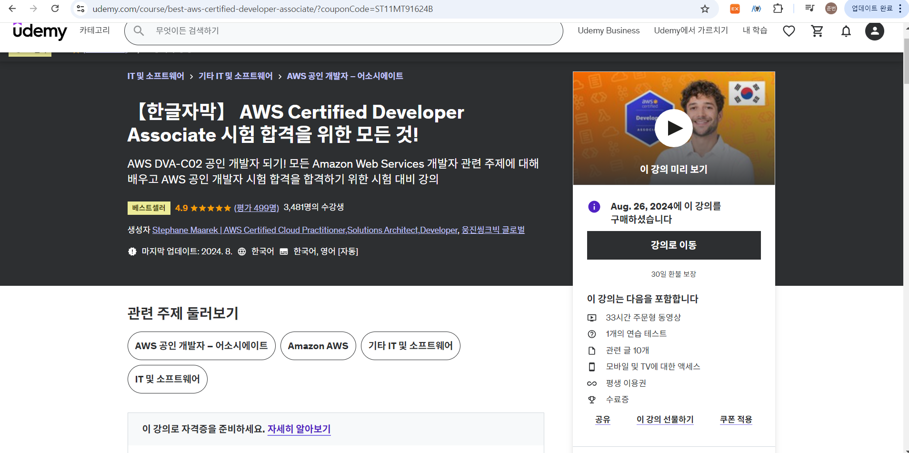

## 🌊 AWS 스터디

### ✅ Description
| 스터디 명     | AWS 분해 스터디              |
|--------|-------------------------|
| 활동장소   | 이수역                 |
| 스터디 내용 | AWS infrastructure         |
| 멤버     | 이준범, 박정곤, 박현빈, 이지우            |

### 👥 Members
| 이준범                                |박정곤|박현빈| 이지우 |
|--------------------------------------------------------------------|-|-|----|
| https://github.com/ss7622 |https://github.com/wjd4204|https://github.com/hyeonbinn| https://github.com/wldnfl   |

### 📚 Contents
해당 스터디는 다음의 강의를 기반으로 합니다.
(https://www.udemy.com/share/105Hxw3@QJugatvC5somGBzlaOcBkCNFnWOT5yPihGCjQJdeBof9QrxGIheQJHiJJ6nLlBWOIw==/)

### 👫🏻 How the study progresses
- [ ] Github의 각 주차 폴더에 정리한 내용 업로드한다.
- [ ] 각 주차별 발표자를 정한다.
- [ ] _(발표자)_ 는 매 주차별 퀴즈를 준비하고 스터디 당일 발표를 진행한다.
- [ ] 발표를 듣고 퀴즈를 푼 이후 어려웠던 부분을 공유한다.
